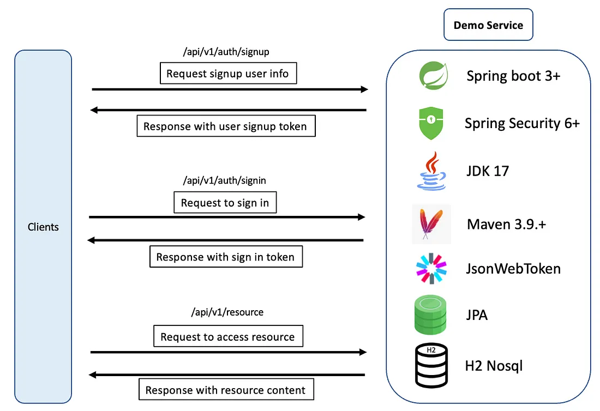
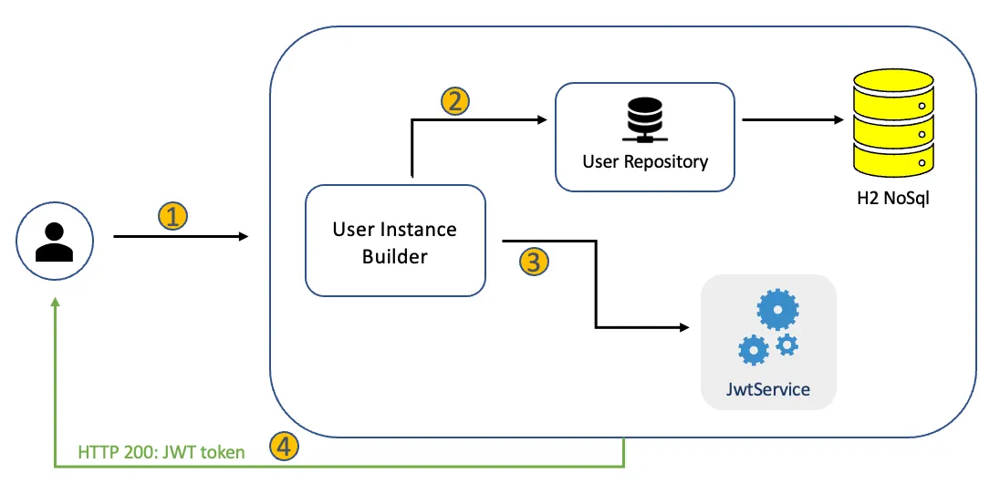
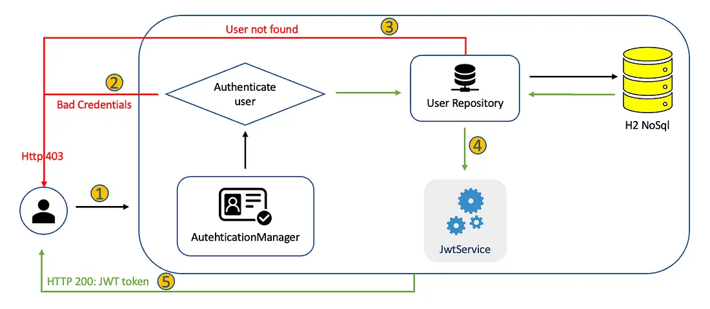
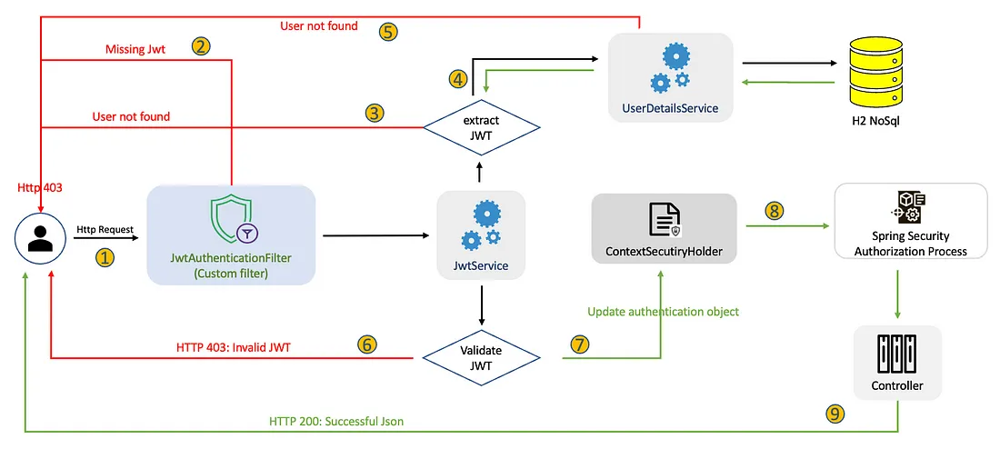

# Security Service Microservice Documentation

## Overview

The Security Service is a comprehensive microservice designed to handle authentication and authorization tasks within a microservices architecture. Leveraging Spring Boot 3+, Spring Security 6+, JDK 17, and Maven 3.9+, this service provides robust security features like user registration, authentication via JWT tokens, and token refresh mechanisms.

## System Architecture Diagrams

Below are the architectural diagrams depicting various aspects of the Security Service:

### Authentication and Authorization Workflow

#### Diagram 1: User Registration and Authentication Flow


This diagram illustrates the process from user registration to obtaining an authentication token.

#### Diagram 2: User Authentication and Token Generation


Details the token generation process upon user authentication.

#### Diagram 3: Token Validation and Access Control


Shows the steps involved in validating JWT tokens and granting access to protected resources.

#### Diagram 4: Error Handling in Authentication


Explains the flow when authentication fails due to various reasons like bad credentials or expired tokens.

## Dependencies

The project uses several key dependencies:

- **`Spring Boot Starter Security`** - Provides essential security configurations.
- **`Spring Boot Starter Web`** - Supports building web applications including RESTful applications using Spring MVC.
- **`Spring Cloud Starter Netflix Eureka Client`** - Enables service discovery with Eureka.
- **`JJWT`** (JSON Web Token) for secure and efficient JWT handling.

  ## Configuration Files

### Application Properties

`application.yml` configuration:

```yaml
spring:
    application:
        name: SECURITY-SERVICE

eureka:
    client:
        serviceUrl:
            defaultZone: http://localhost:8761/eureka/
    instance:
        hostname: localhost
```

`application.properties` configuration:

```properties
# Server configuration
server.port=8089

# Database configuration
spring.datasource.url=jdbc:mysql://localhost:3306/microservices
spring.datasource.username=root
spring.datasource.password=admin
spring.datasource.driver-class-name=com.mysql.cj.jdbc.Driver

# Hibernate configuration
spring.jpa.show-sql=true
spring.jpa.hibernate.ddl-auto=update
spring.jpa.properties.hibernate.dialect=org.hibernate.dialect.MySQLDialect

# logging configuration
logging.level.org.springframework.security= ERROR
```

## API Endpoints

### Authentication Endpoints

- **POST `/auth/register`** - Register a new user.
- **GET `/auth/getToken`** - Generate a new JWT for authenticated users.
- **GET `/auth/validateToken`** - Validate an existing JWT.
- **GET `/auth/refreshToken`** - Refresh an expired JWT.


